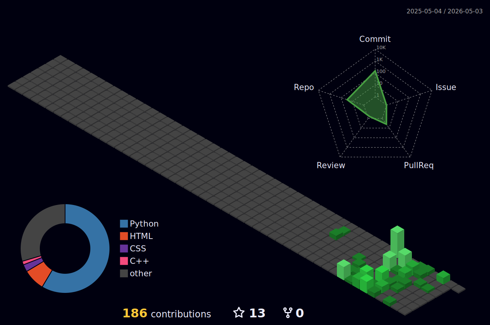

<div align="center">

<!-- HEADER -->


<!-- TYPING SVG -->
<a href="https://git.io/typing-svg"></a>

<br/>

<!-- SOCIAL BADGES -->
[](https://github.com/sayomiyori)
[](https://kwork.ru/user/sayomiyori)
[](mailto:flamxd@mail.ru)

</div>

---

## 🧑‍💻 About

```python
class SayomiYori:
    role      = "Python Backend Developer"
    location  = "Simferopol / Remote 🇷🇺"
    education = "Crimean Federal University (CS, 2028)"
    
    focus = [
        "Microservices (Django + FastAPI + RabbitMQ)",
        "Event-driven architecture & message brokers",
        "CI/CD pipelines, Docker, Observability",
        "WebSockets & real-time systems",
    ]
    
    looking_for = "Backend position in a team with code review & engineering culture"
```

---

## ⚡ Tech Stack

<div align="center">

**`Core Backend`**


**`Data & Messaging`**


**`Infrastructure & DevOps`**


**`Quality & Observability`**


</div>

---

## 🏗️ Featured Projects

<table>
<tr>
<td width="50%" valign="top">

### 🔀 [TaskFlow](https://github.com/sayomiyori/TaskFlow)
**Microservice task platform — Django + FastAPI + RabbitMQ**

`Django 5` `DRF` `FastAPI` `RabbitMQ` `Redis` `Channels` `Nginx` `Docker`

- 🏛️ 2 microservices: Django API + FastAPI notification consumer
- 📡 RabbitMQ topic exchange (task.created, task.updated)
- ⚡ WebSocket updates via Django Channels + Redis
- 🔒 JWT auth, role-based permissions, django-filter
- 🌐 Nginx reverse proxy with rate limiting
- 🧪 pytest + factory_boy, CI/CD on GitHub Actions

</td>
<td width="50%" valign="top">

### 🪝 [WebHook Manager](https://github.com/sayomiyori/WebHook_Manager)
**SaaS platform for reliable webhook delivery**

`FastAPI` `Celery` `Redis` `PostgreSQL` `Prometheus` `Sentry` `Docker`

- 🔄 Celery delivery: exponential backoff (10s→1h), 5 retries
- 🔑 Idempotent intake (X-Idempotency-Key) + HMAC verification
- 🔌 Redis circuit breaker — no events lost
- 🏗️ Clean Architecture (domain/services/infrastructure/api)
- 📊 Prometheus metrics, Sentry, structlog (JSON + correlation ID)
- 🧪 >80% coverage, CI: ruff + mypy strict → pytest → auto-deploy

</td>
</tr>

<tr>
<td width="50%" valign="top">

### 💬 [RealTimeChat](https://github.com/sayomiyori/RealTimeChat)
**WebSocket chat with horizontal scaling**

`FastAPI` `WebSocket` `Redis Pub/Sub` `PostgreSQL` `JWT` `Docker`

- 📡 Redis Pub/Sub fan-out across multiple API replicas
- 💬 Room-based messaging with history (last 50 on connect)
- ⌨️ Typing indicators (real-time, not persisted)
- 🔐 JWT auth on WebSocket connections
- 🧪 CI + Codecov, async stack (asyncpg + redis.asyncio)

</td>
<td width="50%" valign="top">

### 📚 [BookFinder API](https://github.com/sayomiyori/BookFinder-API)
**REST API for book search & cataloging**

`FastAPI` `PostgreSQL` `SQLAlchemy 2` `JWT` `Prometheus` `Grafana` `Docker`

- 📖 10 endpoints (/api/v1/), Google Books integration
- 🗄️ Async PostgreSQL + Alembic migrations
- 📊 Prometheus + Grafana: error rate, latency p95, RPS
- 🔄 CI/CD: ruff → pytest (87% coverage) → Docker → auto-deploy
- 📝 Pydantic v2, Swagger UI, CORS

</td>
</tr>

<tr>
<td width="50%" valign="top">

### 🤖 [ChillLibrary Bot](https://github.com/sayomiyori/ChillLibraryTgBot)
**Telegram book search bot — commercial project**

`aiogram` `aiohttp` `Google APIs` `Gemini AI` `Docker`

- 🔍 3 search modes: title, book cover (Vision OCR), quote (Gemini AI)
- 📦 Full cycle: spec → architecture → dev → tests → deploy → docs
- 🏛️ Layered architecture (handlers/services/utils)
- ✅ Delivered to client, accepted without revisions

</td>
<td width="50%" valign="top">

### 💪 [BodyTelling Bot](https://github.com/sayomiyori/BodyTellingTelegramBot)
**Fitness club Telegram bot — commercial project**

`aiogram` `APScheduler` `pytest`

- 🎯 Workout selection algorithm by 5 parameters
- 🔥 Retention mechanics: streaks, achievements, auto-reminders (TZ-aware)
- 📦 Modular codebase, pytest + conftest
- ✅ Commercial delivery with full documentation

</td>
</tr>
</table>

---

## 🧠 Architecture Decisions

> Why this stack? Every choice is intentional.

**TaskFlow** — Django for ORM-heavy domain logic (models, permissions, admin) + FastAPI for the async notification consumer. Each framework where it's strongest. RabbitMQ topic exchange instead of direct HTTP calls — write-side transactions stay decoupled from delivery, and adding new event handlers doesn't touch core API code.

**WebHook Manager** — Celery with Redis broker for delivery retries because webhooks are fire-and-forget by nature — the caller shouldn't wait. Circuit breaker in Redis prevents hammering a dead endpoint. HMAC + idempotency key at the intake layer, not in business logic — infrastructure concern stays in infrastructure.

**RealTimeChat** — Redis Pub/Sub instead of in-memory broadcast because in-memory only works within a single process. With Pub/Sub, scaling to N replicas is transparent — each instance subscribes to room channels and fans out locally. WebSocket auth via query param token, not headers, because browsers don't support custom headers on WS handshake.

**BookFinder API** — Async SQLAlchemy 2 + asyncpg instead of sync ORM because the main bottleneck is I/O (database + Google Books API). Prometheus from day one, not as an afterthought — error rate spike is visible in the dashboard before the first bug report arrives.

**ChillLibrary / BodyTelling** — Commercial projects built to spec. Layered architecture (handlers → services → utils) so the client's next developer can onboard without a call. Deployed on Railway with Docker — client doesn't need to maintain infrastructure.

---

## 📊 GitHub Stats

<div align="center">


<br/>


</div>

---

## 🧊 3D Contribution Calendar

<div align="center">



</div>

---

<div align="center">


<br/><br/>


</div>

---

## 🐍 Contribution Snake

<div align="center">

<picture>
  <source media="(prefers-color-scheme: dark)" srcset="https://raw.githubusercontent.com/sayomiyori/sayomiyori/output/github-snake-dark.svg" />
  <source media="(prefers-color-scheme: light)" srcset="https://raw.githubusercontent.com/sayomiyori/sayomiyori/output/github-snake.svg" />
  
</picture>

</div>

---

<div align="center">

**Open to opportunities · Python Backend Developer · Remote**

</div>


